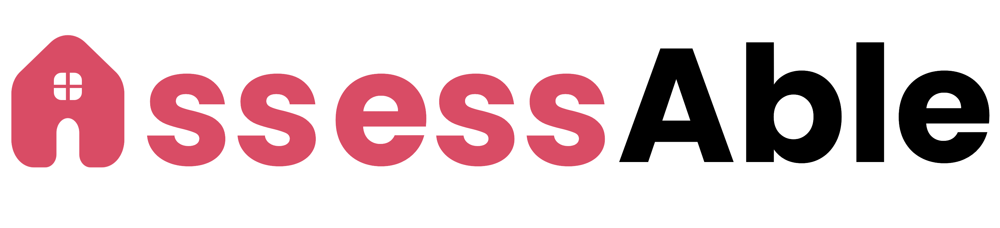

# AssessAble

## Inspiration

Home should be the safest place. But for millions of older adults, it’s where the greatest risks hide.

By 2030, **1 in 5** Americans will be over 65 [[1]](https://www.prb.org/resources/fact-sheet-aging-in-the-united-states/), and **9 in 10** adults over 50 prefer to stay in their own homes as they age [[2]](https://www.upi.com/Health_News/2022/04/13/Americans-age-in-place/1201649856750/).

Yet, every year, **3 million seniors** are rushed to emergency rooms because of falls [[3]](https://www.cdc.gov/falls/data-research/facts-stats/index.html) - and **80%** of such accidents happen inside their own homes [[4]](https://pmc.ncbi.nlm.nih.gov/articles/PMC8669898/).

**It doesn’t have to be this way.**

Simple changes such as installing grab bars, adding non-slip flooring, or removing trip hazards can dramatically reduce these risks. They save lives, preserve independence, and ease the emotional and financial burden on families.

_So why aren’t more homes safer?_

- **Overlooked**: Many seniors miss the hidden risks in their own homes.
- **Overwhelmed**: Others are weighed down by the cost, confusion, and fear of losing the character of their space.
- **Unsupported**: Family caregivers want to help, but often lack the guidance to know where to begin.

Presenting **`AssessAble`**, an AI-powered tool to help older adults age safely in their own homes.

Our bold mission: To empower older adults to stay safe, independent, and connected to the homes that hold their fondest memories.

## What it does

`AssessAble` begins by identifying the user's physical needs, offering flexible accessibility options such as typing or speech-to-text input. Next, caregivers are guided through a simple home scan by uploading images or videos of spaces within the home, allowing `AssessAble` to detect hidden risks based on ADA safety standards. The tool then suggests personalized modifications - such as handrails, anti-slip mats, and other tailored upgrades - matched to the individual's specific health conditions. Users can browse different design options and select the upgrades that matter most to them, ensuring that safety improvements blend naturally with their home's existing style, without creating an institutional feel. Finally, `AssessAble` generates a detailed PDF report, ready to share with contractors or to keep as a personal guide for future planning.

## How we built it

Using Google Gemini’s multimodal LLM, `AssessAble` analyzes voice, image, video, and text inputs to detect potential hazards and recommends specific, tasteful modifications (such as installing grab bars, fold-down shower seats, or anti-slip mats) to make the space safer without compromising comfort.

We built `AssessAble` with a FastAPI backend that handles file uploads and processes them through various Gemini 1.5 models using the Gemini's Python SDK. Gemini's powerful understanding across images, spoken commands, and written text was critical to interpreting diverse indoor environments and generating human-like safety assessments. It not only identifies obvious risks, but also offers empathetic, ADA-aligned recommendations tailored to each scenario.

To make this accessible and intuitive for users, we developed a cross-platform mobile app using React Native Expo, allowing caregivers and families to easily scan spaces, review recommendations, and visualize modifications directly from their phones or tablets.

After analysis, our system again leverages Gemini to compile the results into a detailed PDF report, embedding the selected images alongside AI-generated rationales, personalized modification suggestions, cost estimates, and installation guidance. This report provides caregivers with a clear, professional plan that can be easily shared with contractors or used for future home improvements.

Gemini’s multimodal capabilities allowed `AssessAble` to move beyond rigid checklists and deliver intelligent, flexible evaluations of real-world living spaces. By understanding context, prioritizing risks, and suggesting minimal, dignified improvements, `AssessAble` helps seniors age safely, gracefully, and independently at home.

## Challenges we ran into

One major challenge we faced was guiding the photo-taking process for users. For `AssessAble` to provide accurate safety recommendations and evaluate modifications against ADA compliance standards, we needed photos that captured enough detail for rough spatial estimation. We spent time designing clear but simple instructions to help caregivers photograph spaces properly.

Another major challenge was prompt engineering. Elderly users or caregivers might submit vague or incomplete inputs, so we had to craft precise prompts for Gemini that could still elicit specific, actionable suggestions even from imperfect data. Managing the multimodal nature of the app - combining visual, spatial, and textual information - added further complexity to how we structured our AI queries and parsed the results.

Finally, visual quality was crucial. When suggesting modifications such as grab bars or fold-down shower seats, it was important that the AI-generated visuals showed these additions blending naturally into the existing environment. Maintaining a warm, familiar aesthetic, rather than a clinical, institutional look, was essential for helping users feel comfortable accepting changes. These realistic mockups also gave users clear visual references they could share with contractors or use for their own DIY home improvement projects.

## Accomplishments that we're proud of

We are proud that `AssessAble` places a premium on accessibility, not only in its purpose but also in its design. Throughout development, we focused on making the experience intuitive for caregivers and older adults alike, offering clear instructions, easy uploads, and outputs that are actionable without technical expertise.

Another accomplishment we are proud of is how we challenged ourselves by relying exclusively on Google Gemini for all intelligent analysis. Rather than combining multiple APIs or fallback systems, we pushed Gemini’s multimodal capabilities to the limit, using it for hazard recognition, modification recommendations, spatial reasoning, and visual mockups. This deliberate choice forced us to engineer careful prompts, handle vague or incomplete inputs creatively, and fully explore the range of what a single, powerful model could achieve.

Most of all, we are proud that despite these challenges, `AssessAble` delivers high-quality, empathetic, and visually polished outputs that empower users to make real, meaningful improvements to home safety, helping them live more independently, confidently, and with dignity.

## What we learned

From a technical perspective, working with Google Gemini gave us deep insight into the current forefront of multimodal AI. We learned firsthand how advanced Gemini has become in generating coherent, context-aware text from a wide variety of visual and textual inputs. Its ability to reason about spatial layouts, safety hazards, and ADA compliance through images was impressive. However, we also encountered the model’s current limitations: while text generation is highly reliable and nuanced, image generation - particularly when requiring precise object blending and realistic home modifications - still needs further development. Achieving visually natural modifications often required careful prompt engineering or supplementing Gemini with other image tools to enhance the final output. Through this process, we developed a more nuanced understanding of when and how to trust a single model, when to engineer smarter prompts, and when it is strategic to combine AI outputs with traditional software techniques. This project taught us not only what Gemini is capable of today, but also where the future of multimodal AI still has room to grow.

Through building `AssessAble`, we also gained a deeper understanding of the real-world challenges faced by older adults and their caregivers. We learned how common and devastating falls are among the elderly, and how difficult it can be to balance safety improvements with maintaining a sense of dignity and comfort in the home. Hearing about caregiver fatigue left a strong impact on us, and underscored the importance of designing solutions that are not only effective, but emotionally sensitive and easy to implement.

On a personal level, our team grew tremendously as well - one of our beginner coders learned how APIs work, how to send and receive data between systems, and how to build real applications that interact with powerful models like Gemini. Overall, this project gave us both greater empathy for the people we hope to serve and new technical skills to bring ideas to life.

## What's next for AssessAble

Looking ahead, we see many opportunities to expand `AssessAble`’s capabilities. One key feature we plan to introduce is offering multiple alternative solutions for each identified issue. For example, if a bathroom lacks a safe bathing option, the app could suggest several alternatives - such as installing a fold-down shower seat, using a portable transfer bench, or remodeling the shower area entirely - allowing users to choose the option that best fits their budget, aesthetics, and needs.

We also plan to broaden `AssessAble`’s focus beyond fall prevention to address a wider range of accessibility challenges faced by older adults and people with disabilities. Future versions could detect and suggest solutions for issues related to low vision (e.g., recommending better lighting, high-contrast surfaces, or tactile flooring cues), hearing loss (e.g., visual alert systems for alarms or doorbells), and cognitive or memory difficulties (e.g., simplifying room layouts or labeling important objects).

In addition, we are committed to expanding `AssessAble`’s own platform accessibility. We aim to ensure our platform meets WCAG 3.0 guidelines, offering screen reader support, alternative text for images, clear language modes, and other features that make our app usable by people of all abilities.

Ultimately, we want `AssessAble` to be a flexible, empathetic tool that adapts to the evolving needs of every user, helping create safer and more supportive home environments for everyone.
